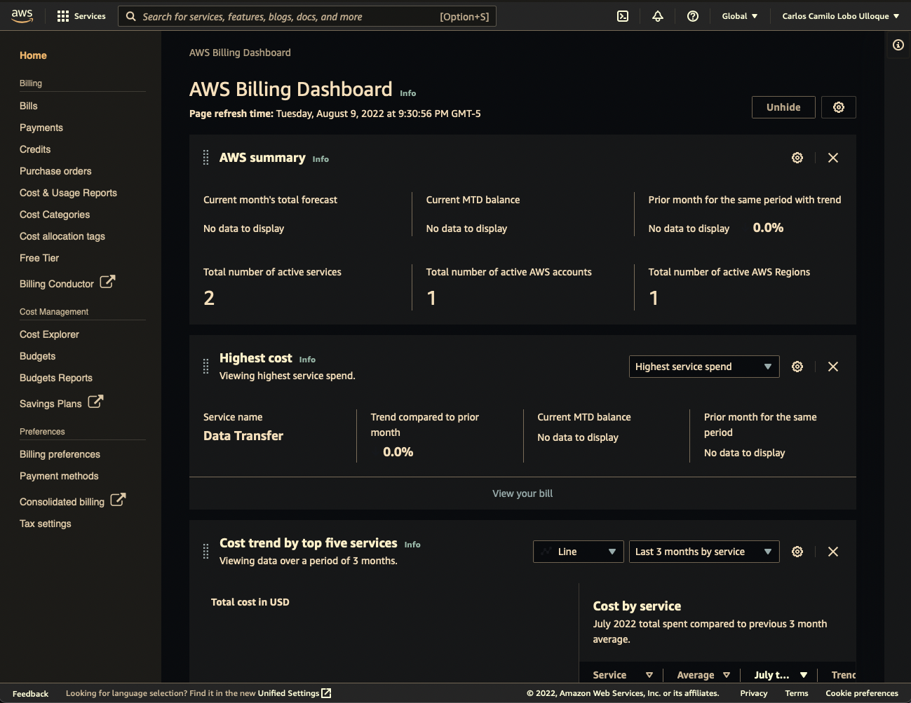

# Billing

<aside>
 [[How To Create A Budget|Make sure]] to always have at least one budget in your account.

</aside>

[[Amadeus/PKM/Musings/What Is AWS|AWS]] provide us with the Billing dashboard page, a page where we can learn about our current bill of the month:

In the billing dashboard we can dive deeper and observe which services are costing us money, in which regions we are incurring those expenses and many other things like configuring our credit card data and creating budgets.

<aside>
💬 Always check the pricing pages of a service before you start using it
 & consult the [[Pricing|Free Tier page]] to find out whether a service is included (and what the Free Tier quotas / limits are).

</aside>

We can set certain tresholds as well so we can be notified before surpassing our budget

## Thresholds

A threshold in this context refers to a percentage that if surpassed we wish to be informed about inmediatly. Budget thresholds can be optionally added when created budgets.