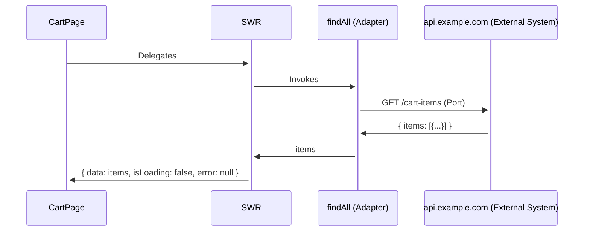
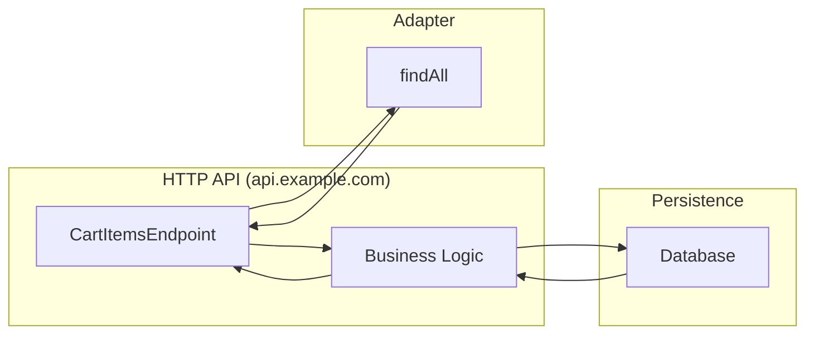

# Front-End Glossary: Adapters

- An "*adapter*” is a is usually brought up in software architecture conversations.
- It is a term associated with the "*Ports and Adapters*” architecture.
- The idea of the “*ports and adapters*” architecture is just a way of abstracting away the complexity that involves talking to other systems. What's beneath this abstraction layer should doesn't matter to the immediate consumer.
- We can think of "*ports*" as the doors that your app uses to communicate with the outside world. They are the communication channels where data is exchanged. In your typical web application, a port would be an HTTP API that exposes a number of endpoints for others to consume.
- We can think of “*adapters*” as the consumers of those ports. They are plugged in to the ports. In your typical web application these are locations where we try to communicate with external systems.
- Depending on your background, an “external system” may sound like a buzzword. In Front-end development we do not think of our browser as a system however in this case it is one. Which means communicating with an “external system” refers to using an HTTP API or some SDK to perform request resources under the hood.

```jsx
// cart-items.adapter.ts

/*
 * @description
 * An adapter's method responsible for fetching the cart items from
 * an external API.
 */
export const findAll = async () => {
		try {
      const response = await fetch('https://api.example.com/cart');

      const items = await response.json();
      
			return items;
    } catch (error) {
      console.error('Error fetching cart items:', error);

			return [];
    }
  };

// cart-page.ts
import useSWR from 'swr';
import { findAll } from './cart-items.adapter';

export const CartPage = () => {
  const { data: cartItems, isLoading, error } = useSWR("shopping-cart-items", findAll);

  if (error) {
    return <p>Error fetching cart items.</p>;
  }

  if (isLoading) {
    return <p>Loading cart items...</p>;
  }

  return (
    <section className="shopping-cart">
      <h2>Shopping Cart</h2>
      {cartItems.length > 0 ? (
        <div>
          <h2>Cart Items</h2>
          <ul>
            {cartItems.map((item) => (
              <li key={item.id}>
                {item.name} - ${item.price}
              </li>
            ))}
          </ul>
        </div>
      ) : (
        <p>Your cart is empty.</p>
      )}
    </section>
  );
};
```



