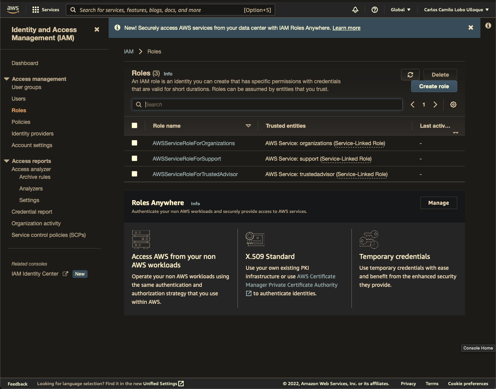

# Roles

Roles are typically used by services. They are used to grant [[Amadeus/PKM/Musings/What Is AWS|AWS]] services permission to perform tasks in [[Amadeus/PKM/Musings/What Is AWS|AWS]] on our behalf (e.g, starting another service or having a web server use a file storage service). If not assigned with proper permissions, attempting to do the task will fail.

<aside>
 A role is inteded to be used by anyone who needs it.

</aside>