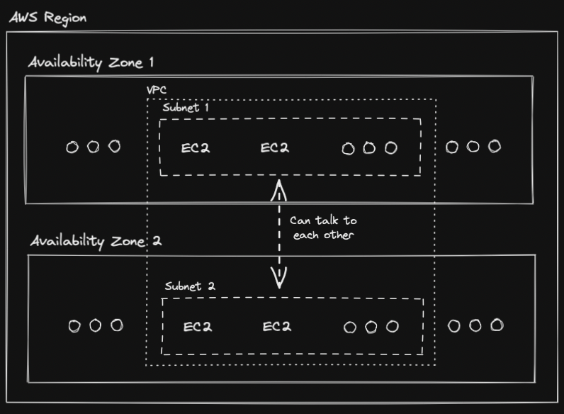

# Subnetworks

A subnetwork (Also known as subnet) is a concept used to refer to a range of [[IP Addresses|IP addresses]] in a [[What Is A VPC|VPC]], under the hood, they take a portion of them from the [[What Is A VPC|VPC]] they belong to in order to function.

The idea is that resources residing within your [[What Is A VPC|VPC]] are grouped into subnets which can have different connectivity and region placement settings.

Subnets must reside within one [[Availability Zones|availability zone]] (Can be chosen). Resources residing in a subnet can talk to other resources residing in other subnets (Communication is possible as long as they reside the same [[What Is A VPC|VPC]]).

<aside>
 [[Amadeus/PKM/Musings/What Is AWS|AWS]] recommends having at least 2 subnets for higher availability.

</aside>

[[Public Subnetwork]]

[[Private Subnetwork]]