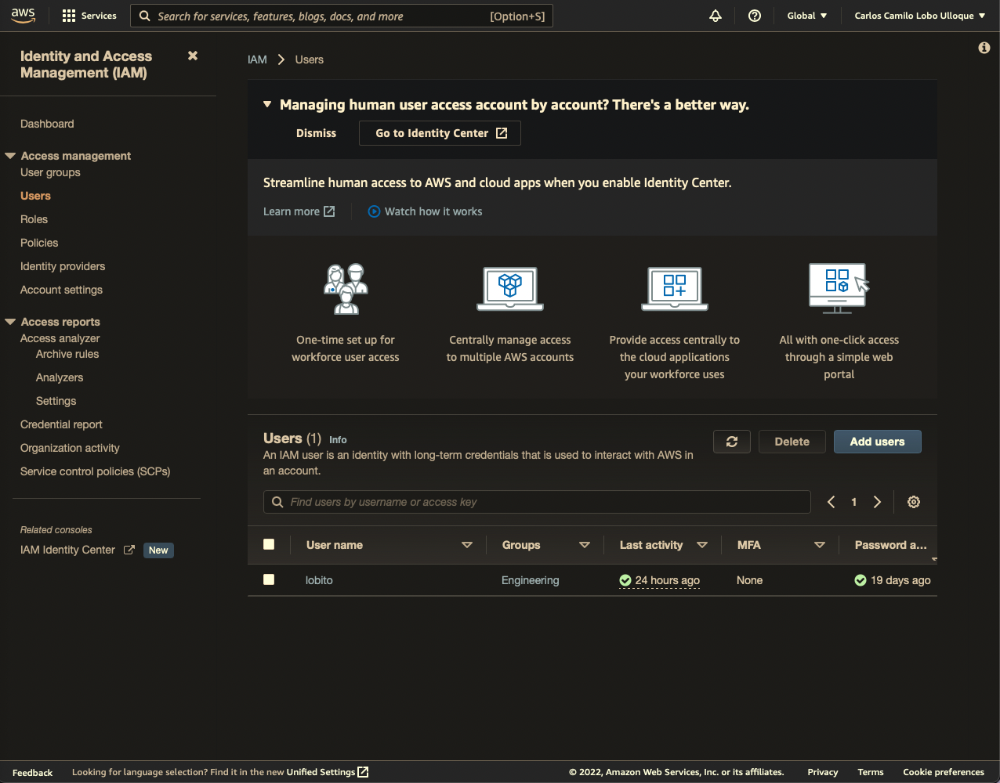

# Users

Users are physical people that exists in our organizations. Every user has its own username and password they can use to sign-in into [[Amadeus/PKM/Musings/What Is AWS|AWS]]. We can find all the details of our [[Amadeus/PKM/Musings/What Is AWS|IAM]] users using our root account.

<aside>
 Every person that should be able to access the [[Amadeus/PKM/Musings/What Is AWS|AWS]] account should have its own user.

</aside>