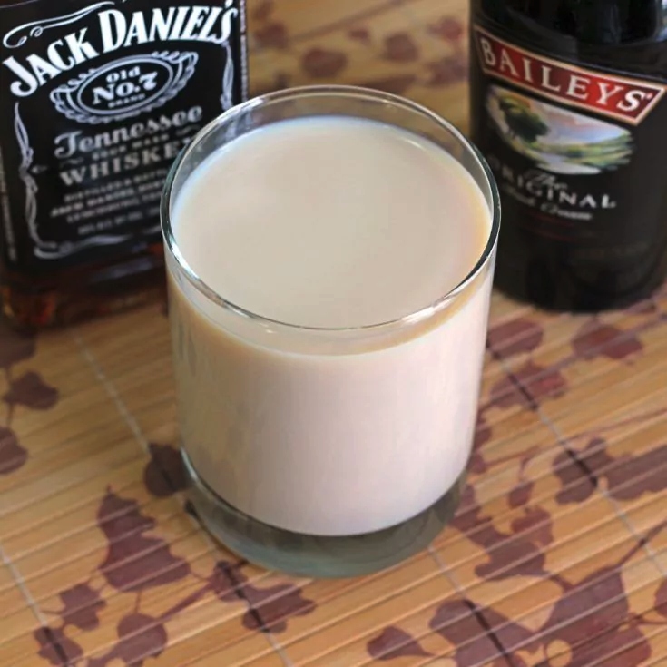

# Bailey

---

## Pasos

- Vertir 1/2 taza de leche condensada.
- Vertir 1/2 vaso de leche.
- Vertir 1 cucharada de leche en polvo
- Vertir 1 cucharada de café instantáneo.
- Vertir 1 cucharada de cocoa.
- Vertir 1 cucharada de esencia de vainilla.
- Vertir 1 shot de whisky.
- Licuar los productos.
- Servir la mezcla en un vaso con hielo.

## Ingredientes

[Untitled](../../Ingredientes/Ingredients_all.csv)

filters: 
~uT^
sort: 
Name: ascending

## Utencilios De Cocina

[Untitled](../../Utensilios%20de%20Cocina/Kitchenware_all.csv)

filters: 
eTBH