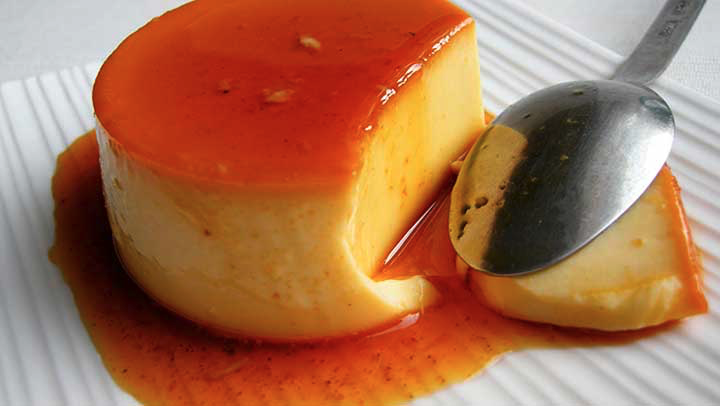

# Quesillo

---

## Precondiciones

- Precalentar el horno a 350 F (177C).

## Pasos

### Caramelo

- En un molde para quesillo poner:
    - 1 y 1/2 tazas de azúcar.
    - 1/2 taza de agua.

### Base

- Derretir 1 cucharadita de mantequilla en el horno microondas.
- En la licuadora poner:
    - 1 y 3/4 de tazas de agua.
    - 3/4 de tazas de azúcar.
    - 10 cucharadas de leche en polvo.
    - 1 cucharadita de esencia de vainilla.
    - La mantequilla derretida.
- Batir los huevos de uno en uno e ir poniéndolos en la licuadora.
- Hacer la mezcla con la licuadora.
- Vertir la mezcla de la licuadora en el molde.
- Hornear la mezcla hasta que al introducir un cuchillo/palillo salga limpio.
- Dejar reposar el quesillo.
- Voltearlo en un plato.

## Ingredientes

[Untitled](../../Ingredientes/Ingredients_all.csv)

filters: 
~uT^
sort: 
Name: ascending

## Utensilios De Cocina

[Untitled](../../Utensilios%20de%20Cocina/Kitchenware_all.csv)

filters: 
eTBH