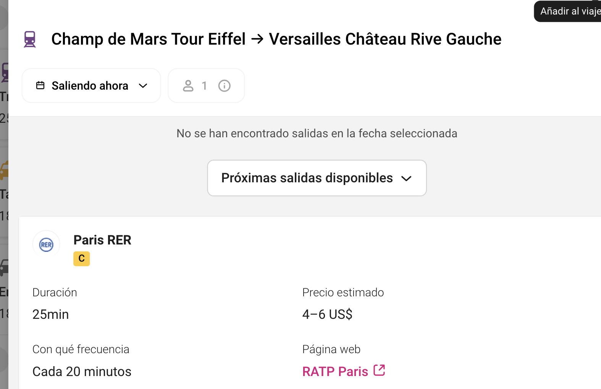
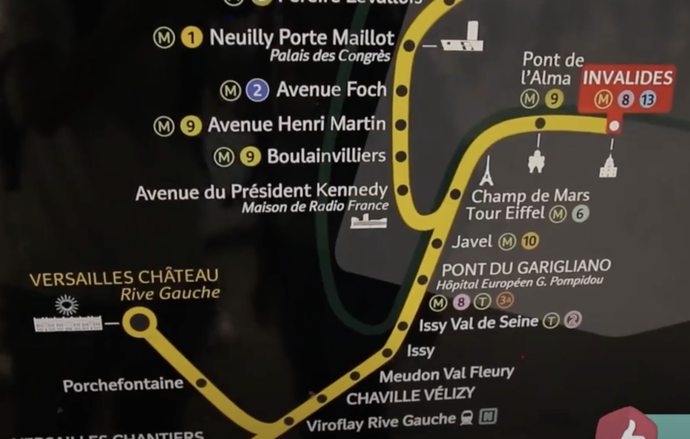
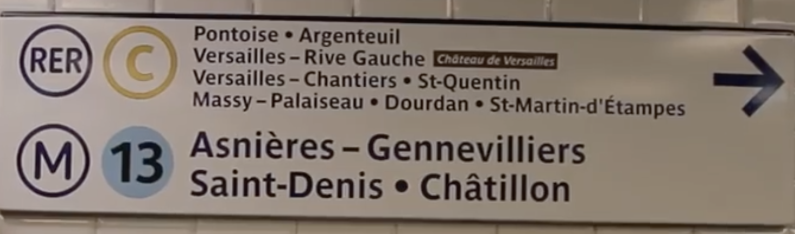
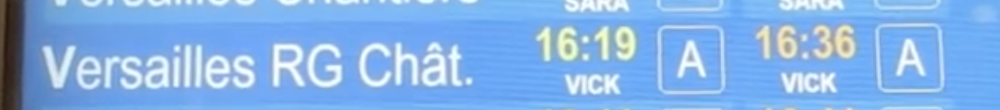
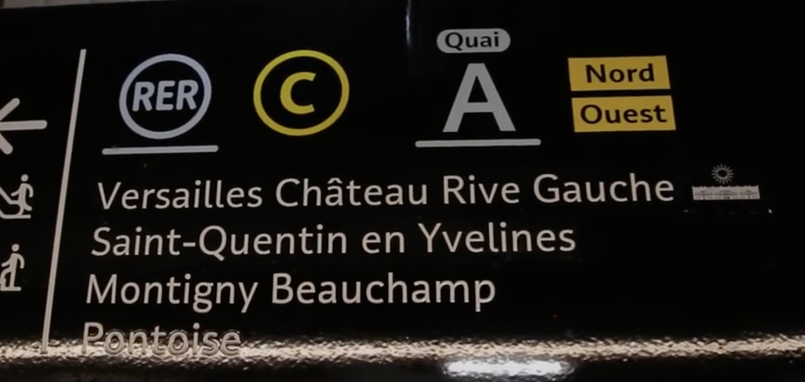
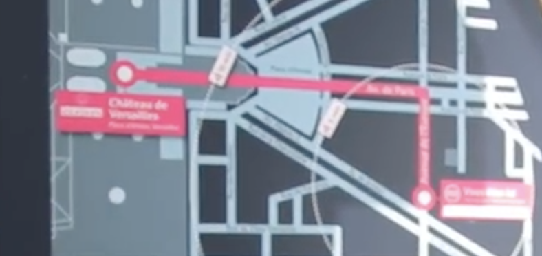

# Versalles

tren se llama RER. El RER es un medio de transporte exclusivo de París y sus suburbios. El **RER C** es un tren que puede llevarle directamente al palacio de Versalles. Suele tardar entre 1 h y 1:30 h en llegar al palacio, dependiendo de su ubicación inicial.

Estos trenes salen cada 15 minutos y el billete, que tiene que cubrir las zonas 1-4, cuesta unos 4 euros el trayecto. No hace falta que lo reserves con antelación.

Lo primero que deberá hacer es **acercarse a la estación de metro o tren** más cercana desde donde se encuentre. Puede utilizar Google Maps para situarse. Una vez haya encontrado el nombre de la estación, compruebe si por ella pasa el RER C. En caso afirmativo, puede tomar el tren directamente, asegurándose de que va en la dirección correcta, es decir, hacia Versalles (**Versalles Château – Rive Gauche**). Según dónde tome el RER C, puede que deba hacer un cambio de trenes.

Si por la estación de metro más cercana no pasa el RER C, compre 2 billetes que sean válidos tanto para metro como para RER (un viaje de ida y vuelta desde París hasta Versalles le costará unos 7 €) y busque la estación de metro en la que deba pararse para coger el RER C. Una vez hecho esto, tal y como se explica más arriba, deberá tomar el tren RER correcto, es decir, el que le lleve a Versalles.

Cuando llegue a su destino, **deberá caminar unos 10 minutos** hasta el palacio de Versalles. Es fácil encontrar el camino hacia el palacio, ya que hay indicaciones para ayudarle.

https://www.pariscityvision.com/es/versalles/como-llegar-versalles-desde-paris

https://es.versailles-tourisme.com/informacion-practica-y-consejos/como-llegar#:~:text=Desde%20Par%C3%ADs%20y%20sus%20alrededores&text=Hay%20varias%20opciones%20a%20su,Torre%20Eiffel%2C%20unos%2030%20minutos.

autobus https://www.viajeroscallejeros.com/como-ir-de-paris-a-versalles/#:~:text=La%20forma%20m%C3%A1s%20r%C3%A1pida%20de,unos%204%20euros%20eil%20trayecto.

[http://www.guiapracticaparis.com/trenes-rer-paris.php#:~:text=Para el tramo urbano%2C los,billete hasta el destino escogido](http://www.guiapracticaparis.com/trenes-rer-paris.php#:~:text=Para%20el%20tramo%20urbano%2C%20los,billete%20hasta%20el%20destino%20escogido).

## ¿Cuál es la estación más próxima al palacio?

La estación **Versailles Château - Rive Gauche** es la más cercana al palacio (se tarda 10 minutos a pie).  Accesible desde el centro de París (Champs de Mars, Invalides, Musée d'Orsay...), forma parte de la Línea C del RER.

Esta estación es la más frecuentada, le recomendamos que compre un billete de ida y vuelta para evitar las colas de espera en las taquillas a su regreso. Todos los trenes con salida de esta estación pasan por París.

guia 

[https://www.tripadvisor.co/ShowTopic-g187147-i14-k8535714-o10-A_Versalles_en_tren_desde_Paris_Indicaciones-Paris_Ile_de_France.html](https://www.tripadvisor.co/ShowTopic-g187147-i14-k8535714-o10-A_Versalles_en_tren_desde_Paris_Indicaciones-Paris_Ile_de_France.html)

ojo

[https://www.hellotickets.es/francia/paris/como-ir-de-paris-a-versalles/sc-125-2334](https://www.hellotickets.es/francia/paris/como-ir-de-paris-a-versalles/sc-125-2334) COMPARATIVO DE OPCIONES 

[https://www.eutouring.com/chateau_de_versailles_transport.html](https://www.eutouring.com/chateau_de_versailles_transport.html)

[versailles_paris_public_transport_map_eutouring.pdf](Versalles/versailles_paris_public_transport_map_eutouring.pdf)

option -  **Versalles desde París en autobús lanzadera**

**aproximadamente 30-40 minutos**

dos salidas desde la Torre Eiffel al día, su precio es algo alto (alrededor de 25€) y el servicio solo está disponible de martes a domingo entre los meses de enero-octubre.

navigo decouverte  estacion de metro - foto con nombre

5 euros

recarga semanal 30 euros

**La manera de llegar a Versalles en transporte público es utilizando el RER C. Este tren se puede abordar en varios puntos dentro de París.**

**Las estaciones más populares desde las cuales se puede tomar el tren hacia el Palacio de Versalles son: Champs de Mars Tour Eiffel, Pont de l’Alma, Inválides, Musée d’Orsay y Gare Saint Michel.**

**Aunque hay otras estaciones dentro y fuera de París, estas son las que pueden estar más cerca de tu alojamiento o conectarse más fácilmente con alguna línea de metro accesible desde tu hotel.**

**La estación de tren a la que debes llegar para ir a Versalles se llama “Versailles – Château – Rive Gauche”. Desde allí, tendrás que caminar unos cuantos minutos para llegar a la entrada del palacio.**

[https://estoesfrancia.com/actividades/ir-a-versalles/](https://estoesfrancia.com/actividades/ir-a-versalles/) OJO 

RER C Invalidos

region ile de france 

versalles river gauche 3.55 euros cada viaje 

chateu 

pasar filtros 

ver pantalla 

ver en la fila  la pantalla dice en cuanto tiempo viene 

tren - 30 min

caminar 200 m 

seguir mapa en la estación 

bus pont d sèvres 

bus 171 10 am cada hora 

regreso al frente 

30 minutos llegarás desde Pont de Sèvres hasta la Plaza de Armas de Versalles, justo al lado de la entrada.

3 euros  

tour desde torre Eiffel 35 cada uno 

[https://www.pariscityvision.com/fr/navette-versailles-paris](https://www.pariscityvision.com/fr/navette-versailles-paris)

Para volver a París se hace de la misma manera, pero te recomiendo que compres tu boleto lo hagas de ida y vuelta o compres el regreso, porque suele haber mucha gente en las máquinas de Versalles.

75 euros  medio dia

80 euros todo el dia

[https://www.getyourguide.es/paris-l16/versalles-tour-de-medio-dia-desde-paris-t10423/?locale=es-ES&psrc=widget&partner_id=GIYFBFF&utm_medium=online_publisher&cmp=paris66bd6645d144c&currency=EUR&q=París&queryMatch=all&widget=availability&wid=44cc437f-d270-5b3d-8526-cbf95651502f&page_id=10bad99b-aa2d-53ea-b036-bc7bfbaad0ea&visitor_id=83Z2YMPP4MG6OUVG3XGOYIAWGRT8YMRY&date_from=2024-10-11&_pc=1%2C2&lang=en&visitor-id=83Z2YMPP4MG6OUVG3XGOYIAWGRT8YMRY&locale_autoredirect_optout=true#booking-assistant](https://www.getyourguide.es/paris-l16/versalles-tour-de-medio-dia-desde-paris-t10423/?locale=es-ES&psrc=widget&partner_id=GIYFBFF&utm_medium=online_publisher&cmp=paris66bd6645d144c&currency=EUR&q=Par%C3%ADs&queryMatch=all&widget=availability&wid=44cc437f-d270-5b3d-8526-cbf95651502f&page_id=10bad99b-aa2d-53ea-b036-bc7bfbaad0ea&visitor_id=83Z2YMPP4MG6OUVG3XGOYIAWGRT8YMRY&date_from=2024-10-11&_pc=1%2C2&lang=en&visitor-id=83Z2YMPP4MG6OUVG3XGOYIAWGRT8YMRY&locale_autoredirect_optout=true#booking-assistant)

[https://www.versailles-visit.com/palacio-de-versalles-traslados.html](https://www.versailles-visit.com/palacio-de-versalles-traslados.html)